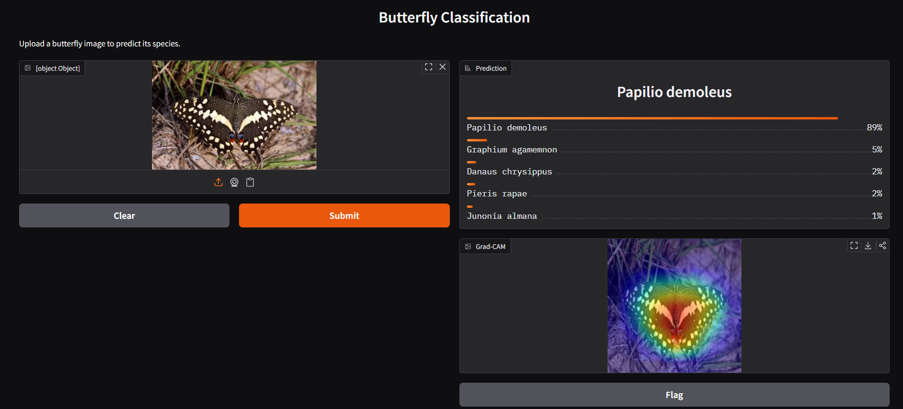
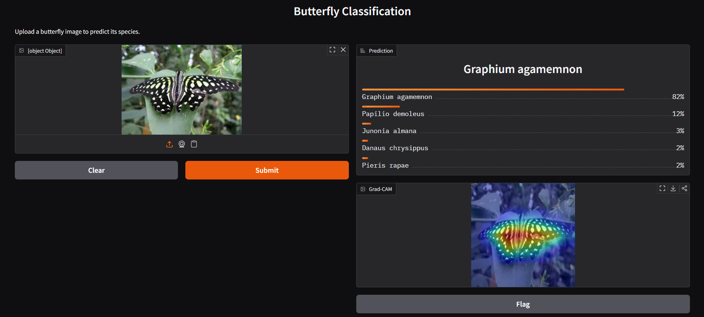
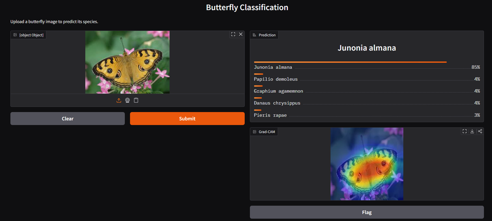
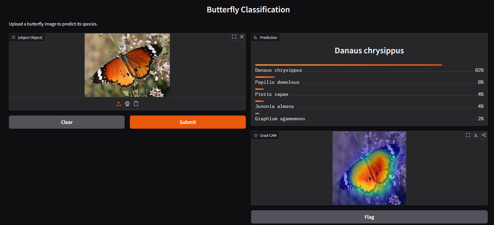
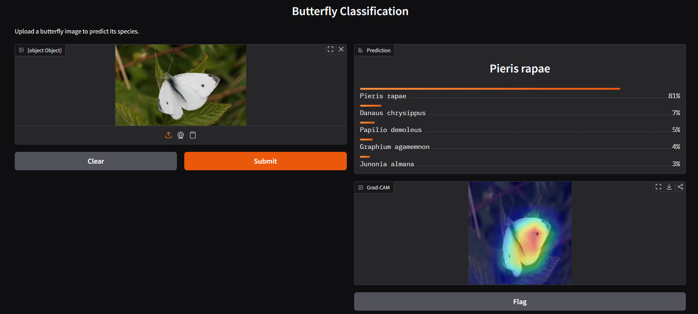

# Butterfly Classification

Ứng dụng phân loại 5 loài bướm bằng mô hình học sâu (PyTorch + timm) và giao diện web bằng Gradio.

## Tính năng

- Phân loại ảnh bướm vào 5 lớp:
	- Danaus chrysippus
	- Graphium agamemnon
	- Junonia almana
	- Papilio demoleus
	- Pieris rapae
- Hiển thị xác suất dự đoán top classes.
- Tích hợp Grad-CAM để giải thích vùng ảnh mà mô hình tập trung khi dự đoán.
- Chạy local nhanh qua Gradio.

## Cấu trúc chính

```text
butterfly-classification/
|-- app.py
|-- model.py
|-- dataset.py
|-- requirements.txt
|-- butterfly_model.pth
|-- dataset/
|   |-- train/
|   |-- val/
|   `-- test/
`-- img/
```

## Yêu cầu

- Python 3.10+
- Windows / Linux / macOS

## Cài đặt

### 1) Clone project

```bash
git clone <repo-url>
cd butterfly-classification
```

### 2) Tạo và kích hoạt môi trường ảo

Windows (PowerShell):

```powershell
py -m venv .venv
.\.venv\Scripts\Activate.ps1
```

Nếu bị chặn quyền chạy script:

```powershell
Set-ExecutionPolicy -Scope Process -ExecutionPolicy Bypass
.\.venv\Scripts\Activate.ps1
```

### 3) Cài thư viện

```bash
pip install -r requirements.txt
```

## Chạy ứng dụng

```bash
python app.py
```

Sau khi chạy, mở link local Gradio trong terminal (thường là `http://127.0.0.1:7860`).

## Kết quả mẫu

### Papilio demoleus



### Graphium agamemnon



### Junonia almana



### Danaus chrysippus



### Pieris rapae



## Ghi chú

- File trọng số mặc định: `butterfly_model.pth`.
- Grad-CAM được tạo theo lớp tích chập cuối của backbone để trực quan hóa vùng quan trọng.
